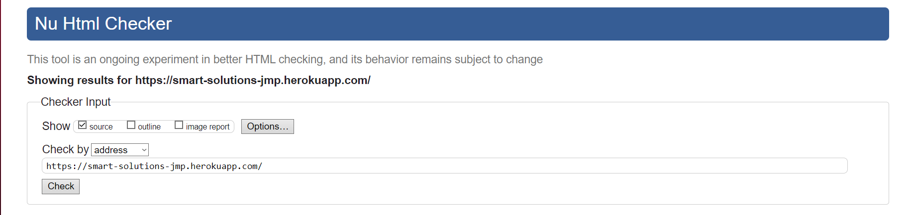

# Smart solutions

## Live site:

https://smart-solutions-jmp.herokuapp.com

---

# Table of content:

- [UI/UX:](#uiux)
    - [User stories:](#user-stories)
- [Epics:](#epics)
- [Content Requirements:](#content-requirements)
    - [Wireframes:](#wireframes-created-using-httpsbalsamiqcomwireframes)
- [Database Schema:](#database-schema)
    - [Models:](#models)
- [Business Model:](#business-model)
    - [Marketing strategy:](#marketing-strategy)
        - [***SEO*** Search Engine Optimization:](#seo--search-engine-optimization)
        - [***Brand Reach***:](#brand-reach)
        - [***Facebook*** Business page:](#facebook-business-page)
- [Technologies Used:](#technologies-used)
    - [Languages & Frameworks:](#languages--frameworks)
- [Existing Features:](#existing-features)
1. [The landing page:](#the-landing-page)
2. [The Navbar:](#the-navbar)
3. [Footer:](#footer)
4. [Contact us page:](#contact-us-page)
5. [The Product page:](#the-product-page)
6. [Product Detail Page:](#product-detail-page)
7. [Sign in page:](#sign-in-page)
8. [Sign up page:](#sign-up-page)
9. [Bag Page:](#bag-page)
10. [Checkout page:](#checkout-page)
11. [Loading Page:](#loading-page)
12. [Thank you page:](#thank-you-page)
    - [Confirmation Email:](#confirmation-email)
- [Testing:](#testing)
    - [HTML Tests:](#html-tests)
    - [CSS Tests:](#css-test)
- [Bugs And Fixes:](#bugs-and-fixes)
- [Credits:](#credits)
- [Deployment:](#deployment)

---

- [Back to top ^](#Smart-Solutions)

---

# Business Model:

Smart Solutions is a Business to customer ( ***B2C*** ) E-commerce online shopping site thats sells Smart home and Smart personal technology, dealing directly from the business to the customer. It has it's own Facebook page for ( ***Brand Reach*** ) to entice new shoppers and some keywords throughout the site to stay inline with the Meta tags. A Robots.txt file and a Sitemap.xml file was implemented for better Search Engine Optimization ( ***SEO*** ) and links for customers to view the privacy policy and an easy way to contact us for maximum customer service which generates trust with the customer leading to referrals.

---

## Marketing strategy:

## ( ***SEO*** ) Search Engine Optimization:
- I've added some short tail and long tail keywords in the Meta tag and added some keywords on the landing page to assist with the SEO. 
- I've also added a robots.txt and a sitemap.xml to maximize google search engines.
- I've also created a newsletter subscription function

---

## ***Brand Reach***:

## ***Facebook*** Business page:

The site has a Facebook Business page to help the business reach further and gain potential customers and updates and discounts can be advertised to entice the shoppers to come and visit the site.

[Facebook page](https://www.facebook.com/profile.php?id=100090772530459)

---

- [Back to top ^](#Smart-Solutions)

---
# Project Overview:

The was designed with an easy to use navigation to all pages with a search bar that can search any category or price or even key words in any product, making the site very accessible and easy to use for any level of user. The Navbar and Footer can be seen on all pages.
The site consists of a sign up, sign in and sign out ability for ease of repeat visits saving users details so check out will be quick and easy with a secure payment system through ( ***Stripe*** ) payments system so all user details are protected.
The user also has the option of signing up for a newsletter and checking out our Facebook page to stay up to date with all the latest deals and discounted products.
There is a Create, Read, Update and Delete ( ***C.R.U.D*** ) functionality for users and staff..... 
- For users:~ 
    - They can write reviews and contact the site directly using the contact us form.
- For staff:~ 
    - They can create, edit, update and delete items in the store with the correct authorization so the average user can not access these areas.
- For store owners:~ 
    - They can access the Admin with their superuser authorization to remove any profanity written in reviews and/or control anything across the store like users, products, Emails Etc.

---

##  Screen shots of the site and it's responsiveness:

I used http://ami.responsivedesign.is/ to check what it would look like on all devices.
As you can see it's fully responsive right across all devices and adapts to any screen sizes.

---

- [Back to top ^](#Smart-Solutions)

---

# UI/UX:

## User stories:
User stories were built in an Agile methodology Kanban board to construct the site and all it's functionality:

---

---

- [Back to top ^](#Smart-Solutions)

---

 # Content Requirements:
    
- ## The UI/UX **MUST** address these:

    - Functioning E-commerce site.
    - Easy site navigation with search bar.
    - Connect to facebook page.
    - User and staff C.R.U.D functionality.
    - Correctly coded links.
    - Add to bag functionality.
    - Easy sign up, Log in and Log out system.
    - Authentication, user must not be able to access edit product are page.
    - Secure Payments.

- ## The UI/UX **SHOULD** address these:
    
    - Privacy Policy access.
    - Send an email of order confirmation.
    - Leave a review.
    - Subscribe newsletters.
    - Contact us easily.
    - See other peoples reviews.
    - Write a review.
    - Receive a confirmation email.
    - Login for ease of second visit.

- ## The UI/UX **COULD** address this:

    - Secure payments link to see how Stripe works.

- ## The UI/UX **WON'T** address this:

    - Coupons will not be added at this time.
    - Users could have a wish list implemented in the future.

## All of the above user stories were met except issues marked as Won't Have.

---

- [Back to top ^](#Smart-Solutions)

---

# The bare bones:

## Wireframes: Created using https://balsamiq.com/wireframes/

The wire frames for the pages showcasing the bare structure of the site.

---

- [Back to top ^](#Smart-Solutions)

----

# Database Schema:

## ***Draw SQL*** 
I used https://drawsql.app/ to create the project's database schema showing the relationship between the models.

#### Models
- ***UserProfile*** - Stores all users details and purchase history also links the user to the reviews and wish list models.
- ***Category*** - Attaches a category to the products and also links to the wish list product model.
- ***Product*** - Stores the product information and links to the wish list, wish list product, review, category and order line item models.
- ***Order*** - Creates the users order details and links to the user profile and order line item models.
- ***OrderLineItem*** - Are the products in the order which links to the order and product models.
- ***contact*** - submits a user created contact form related to an order number with a message for the store owners. 
- ***Review*** - Creates a review for the customer to review the item and/or read other people's reviews and connects to the user profile and the product models.

---

- [Back to top ^](#Smart-Solutions)

---

# Technologies Used:

## Languages & Frameworks:
- HTML - The bare structure of the site.
- Bootstrap - For quick inline styling in HTML code.
- CSS - The styling and positioning of the HTML.
- Javascript - The interactivity of the site.
- Python - The backend functionality.
- Django - To build the project.
- heroku - To deploy the live site.
- Github - To store the project's code.
- Gitpod - To write and push the code for the project.
- Gmail - To send emails.
- Facebook - To create site's Facebook business page.
- VS code - To build the site in.
- AWS(amazon web services) - To host static and image files.
- Stack overflow - For questions and answers.
- ElephantSQL  - To connect the project to the database.

## Others Dependencies :

- ***Balsamiq*** - To create project's wireframes.
- ***Chrome Dev Tools*** - To debug and testing.
- ***W3C HTML Validator*** - To validate the HTML code.
- ***W3C CSS Validator*** - To validate CSS code.
- ***Am I Responsive*** - To generate the responsive preview screens.
- ***Font Awesome*** - For the icons.
- ***Google Fonts*** - For font style.
- ***Stripe*** - To process the online payments with webhooks.
- ***Sitemap*** - To generate the sitemap.xml
- ***Draw SQL*** - To create the database schema diagram.

---

- [Back to top ^](#Smart-Solutions)

---

# Existing Features:

# The landing page:

I've designed the site with a blue/black/white gradient to have a soft approach to the users eye initally with some nice custom images. 
The Logo will take the user back to the home page.
The navigation bar is clear and easy to interpret, changing its background color as a user hover over to allow you to know it is a button.
It has a search bar for searching anything on the site quickly using keywords.
The large white footer makes the links and newletter signup stand out. 

---

- [Back to top ^](#Smart-Solutions)

---

# The Navbar:

The nav bar can be seen on all pages and collapses down for tablets and mobile devices.

## The My accounts link will drop down to show:
- The My profile link that takes the user to their own profile page.
- The Sign out link that takes the user to the Sign out page.

## Depending on authentication:
- The product management option is only seen when staff authentication is active.

The Bag link takes the user to the Shopping Bag page showing the items selected by the user for purchase.
which is fully adjustable and has a Secure checkout and a Keep shopping Button.

---

- [Back to top ^](#Smart-Solutions)

---

## The All Products link drops down to show: ~
- By Price.
- By Rating.
- By Category.
- All Products .
All links have a nice hover effect for better UI/UX.

## The Smart Home drops down to show: ~
- Smart hubs.
- plug ins.
- cameras.
- All home.

## The Special Offers link drops down to show: ~
- New Arrivals.
- Deals.
- Clearance.
- All Specials.

- The Contact us is not a dropdown and takes you straight to the contact us page

---

- [Back to top ^](#Smart-Solutions)

---

# Footer:

## The footer can be found on all pages and consists of: ~

- ### The Subscription for the Newsletter.
    - The user will then receive a thank you for subscribing email.
- ### The social link.
   - which takes the user to the Facebook Business page and Twitter and Instagram pages.
- ### The Privacy Policy link.
    - which takes the user to the Privacy Policy page.
---

- [Back to top ^](#Smart-Solutions)

---

# Contact us page:

- The contact us page is a simple page with a form that can be used by an authenticated or unauthenticated user to submit queries that can be accessed directly from the admin page. 

---

- [Back to top ^](#Smart-Solutions)

---

# The Product page:

## Contains: ~
- All Product images.
- Product names and documentations.
- The prices and Discount Prices if item is discounted.

- A back to top button in bottom right corner 

- ## The Category tags.
    - Which takes the user to all products with the same category.

- ## A rating tag.
    - Which indicates the items popularity to the user.

- ## If user is Staff User.
    - Links to the edit product will appear at the bottom.

---

- [Back to top ^](#Smart-Solutions)

---

# Product Detail Page:

## Contains: ~
- An individual image of selected product.
- Product name and price or Discount price.
- The category.
- The documentation.
- The Quantity selector.
- Add to bag Button.
- Keep Shopping Button.
- Reviews.

- (Added after inital submission) Stock count and associated logic

The listed product reviews will appear just below the item. Just below that, if the user is authenicated the ability to add their own review is present. I would like to make this look much cleaner but with the deadline looming i have settled with basic functionality for now!

The stock count function will display a green, orange or red stock level based on how close the item is to running out, with green being well stocked and red being out of stock. 

---

- [Back to top ^](#Smart-Solutions)

---

# Sign in page:

## Contains: ~
- Username.
- Password.
- Remember me check box.
- Home Button.
- Sign in Button.
- Forgot password link.

At the top is a prompt to ask the user to register if not already done so.

---

- [Back to top ^](#Smart-Solutions)

---

# Sign up page:

## Contains: ~
- Email.
- Re-enter Email.
- Username.
- Password.
- Confirm Password.
- Back to Login Button.
- Sign up Button.

At the top is a prompt to ask user to Login if already registered.

---

- [Back to top ^](#Smart-Solutions)

---

# Bag Page:

## Contains: ~
- An image of selected products.
- Product documentation, Price or Discount Price, Quantity selector and subtotal.
- Size if applicable.
- Subtotal, Delivery cost and Grand Total.
- Secure Checkout and Keep Shopping Button.

## which also collapses down for smaller screens sizes like all the other pages.

## The user is alerted each time an item is added to  or removed from the bag.

## The empty bag will notify the user and a KEEP SHOPPING button will bring the user to the Products page. 

---

- [Back to top ^](#Smart-Solutions)

---

# Checkout page:

## If the user is not registered: ~

The form will be blank.

## If the user is registered and signed in: ~

The form will be filled out except Full Name and card details for security reasons.

The items can still be adjusted at this point.

---

- [Back to top ^](#Smart-Solutions)

---

---

# Blog page:

The blog page will contain blog posts related to installing and using some of the products. The creation of blog posts is restricted to Administrators, with plans to include user creation of posts for admin approval at a later version. 

## Comments section: ~

Upon opening a blog post, a comment section is included to allow users to submit a comment. 
Each comment must be approved by the admins before being visible on the site. 

---

- [Back to top ^](#Smart-Solutions)

---

# Loading Page:

## When the Complete Order Button is pressed the user is greeted with a loading page.

---

- [Back to top ^](#Smart-Solutions)

---

 ## Then directed to the: ~

 # Thank you page:
 
 With a message notifying them of the order number and purchase details being sent to their Email Address.

---

- [Back to top ^](#Smart-Solutions)

---

## Confirmation Email

---

- [Back to top ^](#Smart-Solutions)

---

# Testing:

- I have manually tested every part of the functionality every step of the way.
- I add a new MODEL, VIEW, TEMPLATE and link the URLS, I then check all is as it should be.
- Each time I write a new line of HTML, CSS OR JAVASCRIPT I check to see if it looks and acts how I expect it to.
- With the HTML and CSS I targeted certain classes by adding a solid color background to be sure I'm targeting the right section then continue with the styling.
- I made sure that if the user is authenticated then the log out will display under the MY ACCOUNT dropdown and the relevant buttons are shown in the BAG option.
- I made sure that all buttons to delete item and any other buttons that could edit items are removed if the user is not authenticated as a supperuser and an error message appears if user try's to access forbidden area's.
- I deployed the site early so I could physically check the media queries were coded correctly to have the responsive ability required and the CSS, DATABASE and IMAGES displayed correctly.
- I enlisted the help of friends and family to test the site on a range of devices and browsers. I found some errors can occur on the Opera GX and internet explorer browsers but it works perfectly on more widely used browsers. 
- Tests were made to ensure the administrative user could add, delete or update the PRODUCTS successfully.
- Tests were also made to ensure the user could add, delete or update their BAG successfully. 
- Tests were made to ensure REVIEWS could be left by authenticated users.
- Tests for the CONTACT PAGE were also made. The form was tested to ensure the submission of said form did indeed push to the database, and that it was accessible from the admin panel. 
- I added an item to the bag then deleted the item from the database to see if the item is removed from bag after dealing with the errors found The item now deletes from the bag with no errors.
- Testing the add to bag function  making sure no less than 1 and no more than 99 can be added.
- I tested the responsiveness on all screen sizes.
- Every page was put through the W3C HTML Validation checker and after working through all that was marked up in the code was where id's were repeating but the id's are needed so no changes were made and all is working correctly.

## HTML Tests:

- All HTML pages were tested in the W3C validator and errors were fixed. some minor warnings remain and some errors are only present based on the extension of base.html but are not affecting the site. 

- [Back to top ^](#Smart-Solutions)

---

## CSS Test:

- The CSS was also put through the W3C CSS Validation checker with no errors or warnings.

- I then tested the site on Safari, Opera GX and Chrome to make sure all was working correctly.

- Testing the sites Performance, Accessability, Best Practices and SEO on Lighthouse. The results are not ideal, but they are reasonable for the moment. If i had more time before project submission this would definitely be one of my focus points.

---

- [Back to top ^](#Smart-Solutions)

---

# Bugs And Fixes:

## Bug: ~ 
Long words breaking on smaller screens.
## Fix: ~ 
Individually target headers to control font size.
## Bug: ~ 
Order number over running screen on smaller devices.
## Fix: ~ 
Add a break in the number with the (truncatechars:6) technique in the HTML.
## Bug: ~ 
Reviews all crunched up if a long sentence was written.
## Fix: ~ 
Added line height to reviews text.
## Bug: ~ 
Product not found in database on checkout was stopping the checkout process after doing the delete item from database test.
## Fix: ~ 
After printing to console after each line of code in the BAG, CHECKOUT, PRODUCTS and CONTEXT.PY files I just cleared cookies in the browser and all worked fine. It must have had an invalid item hidden somewhere.
## Bug: ~ 
Country field in checkout info was getting cut off at the bottom.
## Fix: ~ 
Make country field box slightly larger in height to fit.
## Bug: ~ 
Validation results wanted me to remove some random closing div tags.
## Fix: ~ 
Remove suggested closing div tags.
## Bug: ~ 
Contact us button was out of spacing with the other buttons on the navbar
## Fix: ~ 
Apply the same styles as previous buttons.
## Bug: ~ 
New user was unable to register for no known reason as it all worked fine before submission.
## Fix: ~ 
I followed the email section of the Boutique Ado walk through again and set up a new password and this seemed to work.

---

- [Back to top ^](#Smart-Solutions)

---

# Credits:

## Many thanks to:~

- ## ***Code Institute***:~ 
for supplying the materials to follow along with and the opportunity to become a ( ***FULL STACK DEVELOPER*** ).  
- ***Tutor Support*** :~ for being there in my many many times of need especially ***Joshua***. He was so quick at finding errors and helping me understand why the errors occur. I hope he enjoys Hogwarts legacy soon!
- ***My Family and Friends*** :~ for testing and constructively criticizing the site in depth to help me create a better UI/UX.
- ***Stack Overflow*** :~ for providing questions and answers at difficult times.

---

- [Back to top ^](#Smart-Solutions)

---

# Deployment:

This project was developed in Visual Studio Code using GitPod workspace. The code was committed to Git and pushed to GitHub in the terminal.

## Deploying to Heroku:

To deploy this page to Heroku from its GitHub repository, the following steps were taken:

1. Create the Heroku App:
    - Select "Create new app" in Heroku.
    - Choose a name for your app and location.

2. Attach the Elephant sql database:
    - Open the heroku Settings tab
    - Add the config var DATABASE_URL, and for the value, copy in your database url from ElephantSQL.
    - On the ElephantSQL page for your database, in the left side navigation, select “BROWSER”
    - Click the Table queries button, select auth_user
    - When you click “Execute”, you should see your created superuser details displayed. This confirms your tables have been created and you can add data to your database

3. Prepare the environment and settings.py file:
    - In the Settings tab, click on Reveal Config Vars and copy the url next to DATABASE_URL.
    - In your GitPod workspace, create an env.py file in the main directory. 
    - Add the DATABASE_URL value and your chosen SECRET_KEY value to the env.py file.
    - Add the SECRET_KEY value to the Config Vars in Heroku.
    - Update the settings.py file to import the env file and add the SECRETKEY and DATABASE_URL file paths.
    - Repeat this process with the;~
        - AWS ACCESS KEY ID.
        - AWS_SECRET_ACCESS_KEY.
        - STRIPE_PUBLIC_KEY.
        - STRIPE_SECRET_KEY.
        - STRIPE_WH_SECRET.
        - EMAIL_HOST_PASS.
        - EMAIL_HOST_USER.
    - In settings.py add the following sections:
        - SITE_ID = 1
        - AWS ACCESS KEY ID
        - AWS_storage
        - allauth
        - allauth.account
        - allauth.socialaccount
        - STATICFILE_STORAGE
        - STATICFILES_DIRS
        - STATIC_ROOT
        - MEDIA_URL
        - DEFAULT_FILE_STORAGE
        - TEMPLATES_DIR
        - Update DIRS in TEMPLATES with TEMPLATES_DIR
        - Update ALLOWED_HOSTS with ['app_name.heroku.com', 'localhost']
        - Ensure that DEBUG is set t False

## Add Stripe Details for payments

4. Payment details in Setting.py:
    - FREE_DELIVERY_THRESHOLD = 20
    - STANDARD_DELIVERY_PERCENTAGE = 10
    - STRIPE_CURRENCY = 'gbp'
    - STRIPE_PUBLIC_KEY = os.getenv('STRIPE_PUBLIC_KEY', '')
    - STRIPE_SECRET_KEY = os.getenv('STRIPE_SECRET_KEY', '')
    - STRIPE_WH_SECRET = os.getenv('STRIPE_WH_SECRET', '')

## Add the INSTALLED_APPS in settings.py file:

5. Installed APPS in Settings.py: 
    - 'home',
    - 'products',
    - 'bag',
    - 'checkout',
    - 'profiles',
    - 'contact',

## Override Static and Media files to be stored in AWS and Deploy to Heroku:

6. Static and media files:
    - STATIC_URL = f'https://{AWS_S3_CUSTOM_DOMAIN}/{STATICFILES_LOCATION}/'
    - MEDIA_URL = f'https://{AWS_S3_CUSTOM_DOMAIN}/{MEDIAFILES_LOCATION}/'

## Create a requirements.txt file:

7. Requirements:
    - Create a file named "Procfile" in the main directory and add the following:
    - web: gunicorn project-name.WSGI
    - Log in to Heroku using the terminal Heroku login -i.
    - Then run the following command: **heroku git:remote -a your_app_name_here** and replace your_app_name_here with the name of your Heroku app. This will link the app to your Gitpod terminal.
    - After linking your app to your workspace, you can then deploy new versions of the app by running the command **git push heroku main** enter your app name and Heroku API Key when prompted and your app will be deployed to Heroku.
    - Then go to Heroku and click on your new app and then click open app. 

## A sitemap.xml file
- To allow search engine bot crawling.

## Finally create a robots.txt file 
- To control search engine bot crawling.

---

- [Back to top ^](#Smart-Solutions)